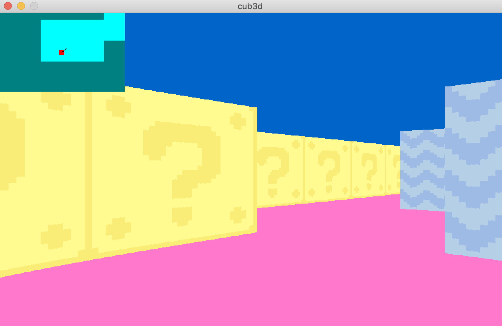

This is the second big partnerproject where i built the raycasting engine to display a 3D POV where the player is able to walk(WASD) and look(->, <-) around a maze.

Here is an Overview of the subject:

[View the Subject](./en.subject.pdf)
